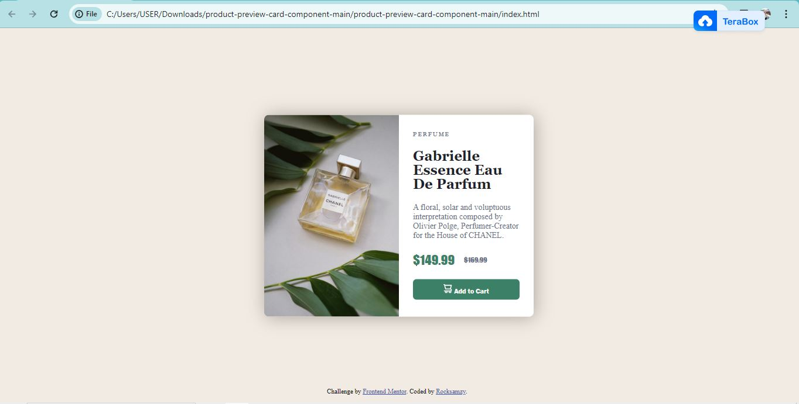

# Frontend Mentor - Product preview card component solution

This is a solution to the [Product preview card component challenge on Frontend Mentor](https://www.frontendmentor.io/challenges/product-preview-card-component-GO7UmttRfa). Frontend Mentor challenges help you improve your coding skills by building realistic projects. 

## Table of contents

- [Overview](#overview)
  - [The challenge](#the-challenge)
  - [Screenshot](#screenshot)
  - [Links](#links)
- [My process](#my-process)
  - [Built with](#built-with)
  - [What I learned](#what-i-learned)
  - [Continued development](#continued-development)
  - [Useful resources](#useful-resources)
- [Author](#author)
- [Acknowledgments](#acknowledgments)


## Overview

A simple Product preview card component containing: product image, product title, product name, product description, product price and Add to cart button. Designed to be responsive.

### The challenge

Users should be able to:

- View the optimal layout depending on their device's screen size
- See hover and focus states for interactive elements

### Screenshot




### Links

- Solution URL: [Solution Code]([https://your-solution-url.com](https://github.com/Rocksamzy/Product-preview-card.git
))
- Live Site URL: [Solution Page]([https://your-live-site-url.com](https://rocksamzy.github.io/Product-preview-card/))

## My process

### Built with

- Semantic HTML5 markup
- CSS custom properties
- Flexbox


### What I learned

It was a great learning process and a worthy challenge for me. Basically i learnt how to manipulate positioning, transform properties and using inline-flex.


```css
.card {
    display: inline-flex;
    position: absolute;
    top: 50%;
    left: 50%;
    border-radius: 8px 8px 8px 8px;
    transform: translate(-50%, -50%);
    box-shadow: 2px 2px 30px rgba(0, 0, 0, 0.3);
}
```


### Continued development

I would like to improve more on positioning, more especially to maintain my pre-defined position on all screen size and to make it more responsive.


### Useful resources

- [W3Schools](https://www.w3schools.com) - This helped me for insight on positioning. 


## Author

- Website - [Ebuka Emmanuel Uzochukwu](https://www.github.com/rocksamzy)
- Frontend Mentor - [@rocksamzy](https://www.frontendmentor.io/profile/rocksamzy)
- Twitter - [@King Nebukar](https://www.twitter.com/valyrianmaester)
- Facebook - [@Ebuka Emmanuel Uzochukwu](https://www.facebook.com/bukar.schwartz)
- Linkedin - [@Ebuka Emmanuel Uzochukwu](https://www.linkedin.com/in/ebuka-emmanuel-uzochukwu-a0145219b
)


## Acknowledgments

I specially that my tutor "Miss Chiamaka" for introducing me to "Frontend Mentor" for this challenge.


